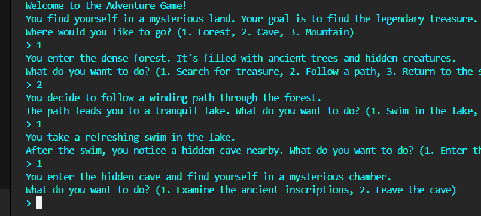

# 🗺️ Adventure Game

A simple text-based **Adventure Game** built with Python that uses `if-elif-else` logic to guide the player through different choices and story paths.

---

## 🎮 Game Description

This is a beginner-friendly Python project where players navigate through an adventure by making decisions. Each decision leads to different scenarios and outcomes. The game is entirely CLI-based and great for learning control flow with `if`, `elif`, and `else` statements.

---

## 🧠 Learning Objectives

- Practice `if`, `elif`, and `else` statements
- Understand basic input/output in Python
- Design a simple branching narrative
- Work with functions and loops (optional enhancements)

---

## 🖼️ Game Preview

